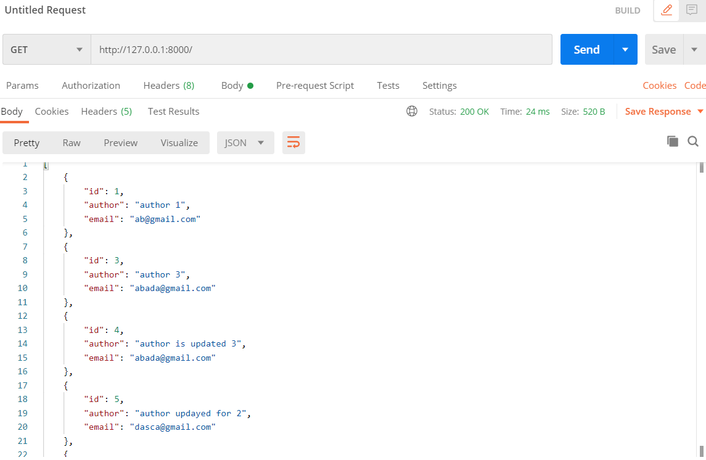

# REST-Api
## REST Api using REST Framework (Create, Read, Update, Delete)   
# Simply run "python manage.py runserver" which will run local server on http://127.0.0.1:8000/ address  

  

# Now on Postman the get request to this url looks like this  

 

# 1.To get specific article detail use link like  

 

# 2.To add a new article in the list, send a post request to the localhost like  

# 3.To Update send a PUT request using the pk (primary key) of the article  

 

# 4.To delete the article using pk send DELETE request like  

